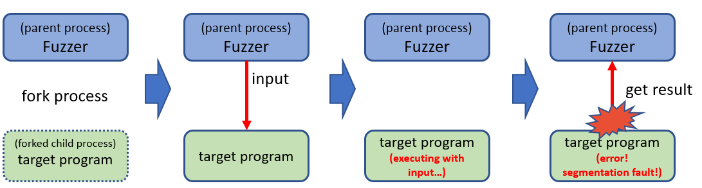
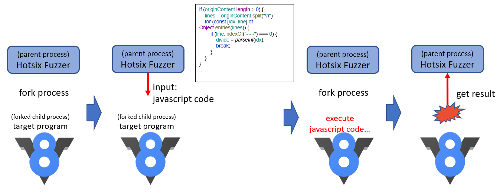
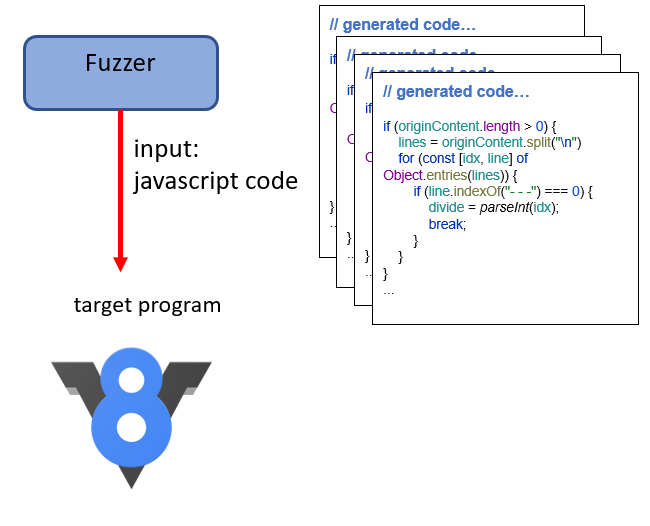
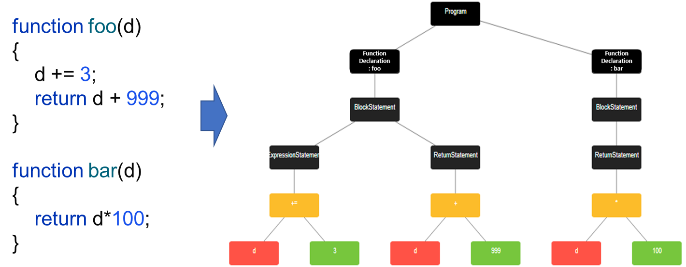
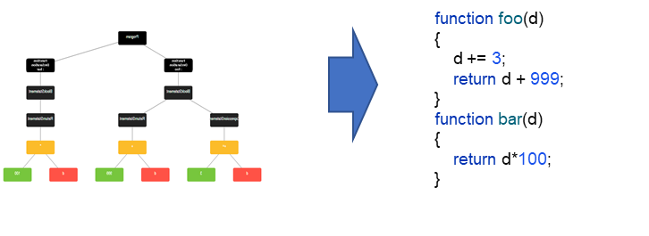
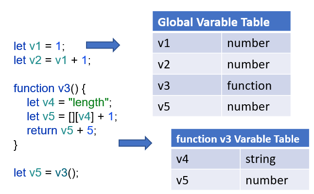
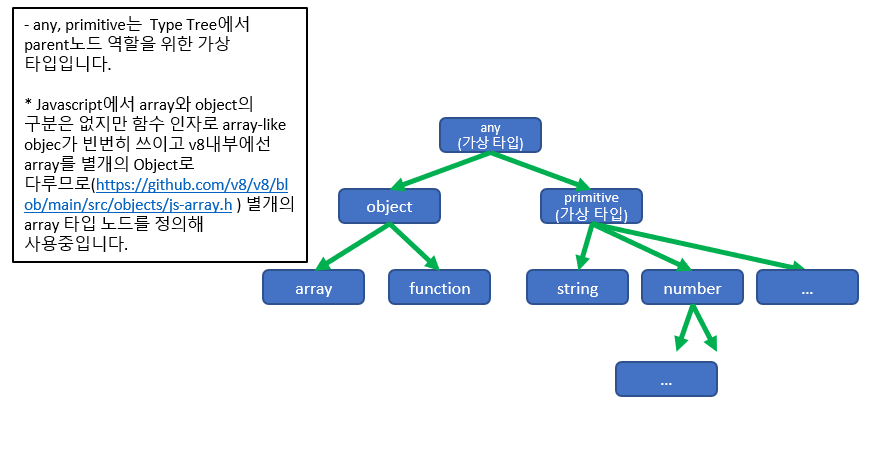
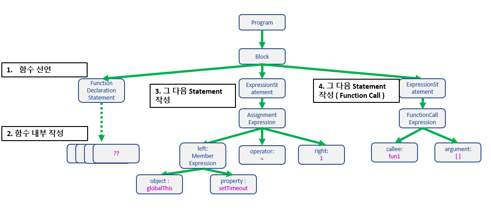
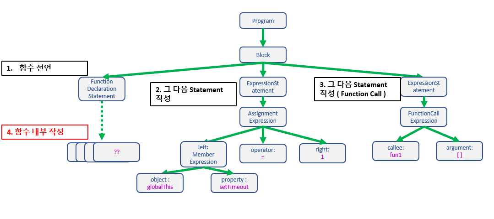

# - Hotsix Fuzzer

### [https://github.com/zbvs/hotsix-demo](https://github.com/zbvs/hotsix-demo)

## 목적 및 소개

#### Fuzzer의 목적과 Fuzzer 소개

- 프로그램의 취약점을 찾을 때 소스코드만 점검하는 것 보다는 자동화 툴을 이용해 찾으면 같은 시간에 더 많은 취약점을 찾을 수 있습니다.
- Fuzzer는 이런 자동화 툴을 지칭하고 Fuzzer를 이용해 테스팅하는 작업을 Fuzzing이라고 합니다.
- Fuzzer는 보통 다음과 같은 프로세스를 거칩니다.

1. child process (target program) 생성.
2. input 생성 & input을 target program에 입력
3. target program 실행
4. 결과 해석
5. 1-4 반복



#### Hotsix Fuzzer 소개

- V8 엔진에 취약한 버그가 있다면 V8 엔진이 특정 Input (Javascript코드) 를 실행시켰을 때 웹 브라우져가 공격당할 수 있습니다.
- Hotsix는 이런 V8 엔진의 버그 테스팅을 위한 Fuzzer입니다. Javascript 엔진이 Target이므로 Input은 Javascript코드입니다.



## 사용법 및 시연

- Hotsix Fuzzer를 간편하게 실행해 볼 수 있게 사용법 문서를 프로젝트 repository에 정리해 두었습니다.
 [https://github.com/zbvs/hotsix-demo](https://github.com/zbvs/hotsix-demo)


## 구조 및 설계

#### Javascript 엔진 Fuzzer가 만들어야 하는 Javascript 코드

- Javascript 엔진 Fuzzer는 Javascript 엔진이 특정 Javascrit 코드를 실행할 때 내부적으로 결함이 없는지 테스팅하는 소프트웨어입니다.
- 따라서 Target Program(V8)의 Input은 Javascript 코드이고 Fuzzer는 Input으로 쓰일 Javascript 코드를 생성해야 합니다.



- 보안적으로 위험한 버그는 단순히 동작을 멈추는 버그가 아니라 exploit(공격 코드)을 실행해줄 수 있는 버그여야
  합니다([exploit 코드 example](https://github.com/vngkv123/aSiagaming/blob/master/Chrome-v8-1260577/poc.mjs)). 이는 만약 버그가 있어도
  Javascrit 코드를 실행하기도 전에 멈춰버리면 공격자가 위협을 줄 수 없는 버그이기 때문입니다. (용도에 따라 다르지만 소프트웨어 취약점 연구 관점에서는 공격 가능한 버그를 찾는 것이 목적입니다.)
- 따라서 생성된 Javascript 코드는 syntax error를 발생시키지 않는 코드여야 하며 runtime error역시 되도록이면 발생시키지 않아야 합니다.

#### 일반적인 Javascript 엔진 Fuzzer의 AST생성

- 이미 지금까지 많은 종류의 Javascript 엔진 Fuzzer가 개발되어 왔습니다. 각각의 Fuzzer들은 각각의 특색이 있지만 AST를 만든 후 AST를 Javascript 코드로 변환한다는 부분은
  비슷합니다. 이 절은 이런 공통적인 부분에 대한 설명입니다.

##### Input 생성 : AST 생성

- 모든 언어는 AST로 표현될 수 있습니다. Javascript 역시 Javascript의 AST로 표현될 수 있습니다.
- 예를 들어 아래에서 오른쪽의 Javascript 코드를 AST로 간략하게 표현하면 왼쪽의 AST로 표현될 수 있습니다.



- 이 말은 어떻게든 AST를 Spec에 맞게만 만들면 최소한 syntax error는 나지 않는 javascript 코드를 생성할 수 있음을 의미합니다.



##### Input 생성 : 변수 테이블을 이용한 AST 구성

- 하지만 AST가 올바르다고 해서 해당 javascript 코드가 runtime error를 발생시키지 않는 건 아닙니다.
- 예를 들어 아래 코드는 올바른 AST로부터 생성되었지만 잘못된 변수 사용으로 runtime error를 발생시킵니다.

```javascript
let a = 1;
b(); //Uncaught ReferenceError: b is not defined
```

- 위와 같은 상황을 방지하기 위해 단순하게 Spec에만 맞는 AST를 작성하는 게 아니라 Variable Table을 관리하며 AST를 작성합니다.
- 예를들어 변수를 선언하는 Javascript 코드를 생성하기 위해
  AST에 [Variable Declaration](https://github.com/estree/estree/blob/master/es5.md#variabledeclaration) 노드를 추가해야 한다면 변수를
  Variable Table에 추가합니다.



#### Hotsix에서 사용중인 AST 생성법

이 절은 앞 절에서 소개해드린 기본적인 AST 구성법과 함께 runtime error를 줄이기 위해 Hotsix에서 사용 중인 부가적인 방법들에 대한 내용입니다.

##### Type Tree

Google의 Javascript 엔진 Fuzzer인 Fuzzilli(https://github.com/googleprojectzero/fuzzilli) 에서 도입한 방법으로 함수의 파라미터 타입에 의한 type
error를 줄이기 위한 방법입니다.

Type Tree를 사용하는 방법을 예로 들어 설명하면 아래와 같습니다.



- 위와같은 Type Tree가 있다고 할 때 Tree에서 상위 노드에 해당하는 타입은 하위 노드와 호환 가능한 타입입니다.
- 예를 들어 [Object.defineProperties](https://developer.mozilla.org/en-US/docs/Web/JavaScript/Reference/Global_Objects/Object/defineProperties)의 첫 번째 인자는 object입니다.
  이때 function이든, array이든 모두 object이므로 Object.defineProperties의 인자로 사용할 수 있습니다. 따라서 Object.defineProperties를 호출하는 코드를 생성할
때 Variable Table에서 function 혹은 array 타입을 꺼내 사용해도 무방합니다.

```javascript
const variable1 = [];
//...
Object.defineProperties(variable1, {
    property1: {
        value: 42,
        writable: true
    }
}); 
```

- 예를 들어 [Array.protype.sort](https://developer.mozilla.org/en-US/docs/Web/JavaScript/Reference/Global_Objects/Array/sort)의 첫 번째 인자는 function 이어야 합니다. function이 아닌 다른 타입을 사용하면 TypeError가 발생합니다. 따라서 Array.prototype.sort를 호출하는 코드를 생생할 때는 Variable Table에서 항상 function 타입을
꺼내 사용해야 합니다.

```javascript
const variable1 = () => -1;
//...
[1, 30, 4, 21, 100000].sort(variable1);
```

##### Lazy Function Initialization

이 방법은 함수 실행 시 runtime error를 줄이기 위해 제가 고안해 Hotsix에 적용한 방법입니다.

- 기존 방법은 AST 작성 시 함수를 생성할 때 [FunctionDeclaration 노드](https://github.com/estree/estree/blob/master/es5.md#functiondeclaration)와 함수 내부 노드들을 같이
  순차적으로 생성합니다.



- 위와 같은 방법으로 작성된 AST로 부터 생성된 Javascript 코드는 불필요하게 함수 내부코드를 먼저 작성합니다. 예를들어 global.setTimeout이 함수 작성 시점에는 function 타입이었지만
  막상 함수를 호출할 시점에는 function이 아닐 수 있습니다.

```javascript
function fun1() {
    globalThis.setTimeout(() => {
    }, 1000);
}

globalThis.setTimeout = 1;
fun1(); //Uncaught TypeError: globalThis.setTimeout is not a function
```

- 이런 문제를 해결하기 위해 함수 생성 시 함수 내부 AST 작성은 함수 호출 때 까지 미루고 호출 시점에 AST를 작성해 이런 형태의 runtime error를 줄였습니다.

