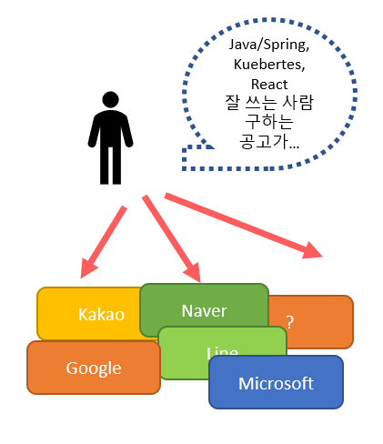
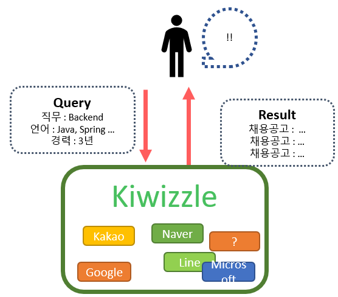
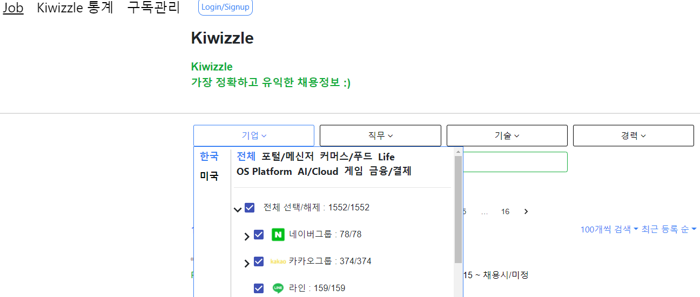
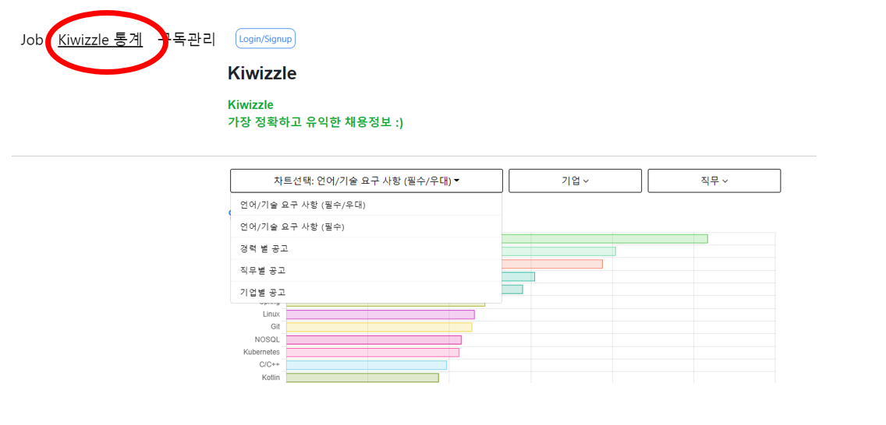
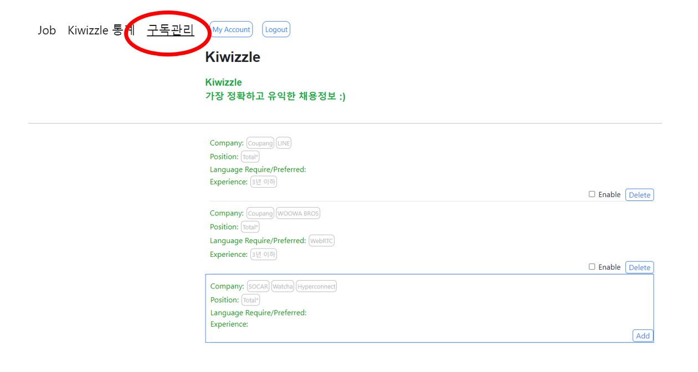
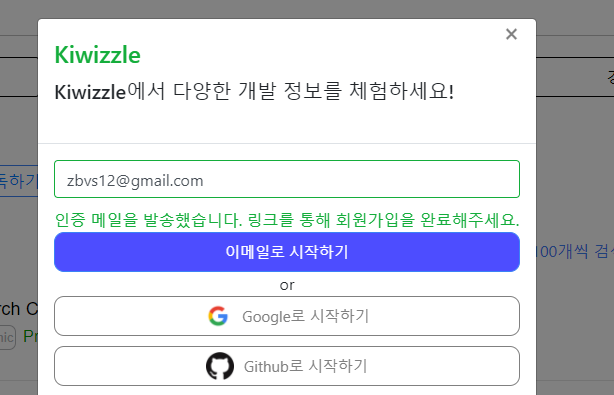
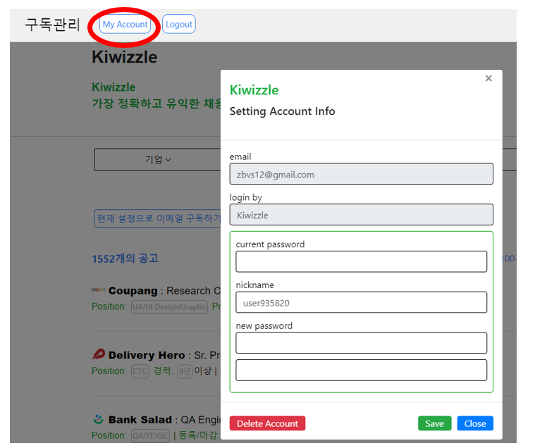

# - Kiwizzle

### [https://kiwizzle.com/](https://kiwizzle.com/)

## 목적

<half>

- 규모가 큰 IT 기업들은 자체 채용페이지에서만 지원을 받는 경우가 많기에 각 회사의 채용 페이지에 들어가 채용공고를 탐색해야 하는 불편함이 있습니다.
- 거기다 현재 채용 페이지들의 필터링 및 검색 기능은 상당히 불편합니다.

<half>

- Kiwizzle은 각 회사들의 채용정보를 통합해 제공합니다.
- 직무, 기술, 경력, 회사 등등의 상세한 조건으로 원하는 정보를 빠르게 찾게 도와줍니다.

## 기능

#### 채용공고 검색

- 메인 화면에서 기업, 직무, 기술, 경력으로 조건을 설정해 채용공고를 조회합니다.
- 기업의 경우 현재는 한국, 미국 두 나라의 대형 기업들의 채용공고를 제공하고 있습니다.

#### 채용공고 통계 조회

- 상단의 Kiwizzle 통계 메뉴를 통해 통계 기능을 이용할 수 있습니다.
- 각 직무별, 기업별 어떤 직군, 어떤 기술을 많이 사용하는지에 대한 통계를 제공합니다.

#### 채용공고 구독

- 로그인 이후 메일 구독 기능을 이용할 수 있습니다.
- 테스트 계정은 id : testuser@kiwizzle.com, pw : testtest 입니다.
- 구독 필터링 설정은 채용공고 조회, 통계 조회에서 설정한 필터링을 그대로 사용합니다.
- 새로운 채용공고가 생성되면 설정한 필터링에 따라 사용자에게 메일을 보냅니다.

#### 회원가입

- 회원가입은 이메일 가입, OAuth2 가입을 지원합니다.
- 이메일 가입 시 JWT가 포함된 인증메일을 전송합니다.

#### 계정관리

- 그밖에 로그인 이후 상단의 My Account 메뉴를 통해 비밀번호 변경, 계정삭제 등의 계정관리 기능을 제공합니다.

## 구조 및 설계

- 구조 및 설계를 포트폴리오에 담기에는 분량이 너무 많아 별도의 문서를 프로젝트 repository에 정리해
  두었습니다. [https://github.com/zbvs/kiwizzle-kube](https://github.com/zbvs/kiwizzle-kube)